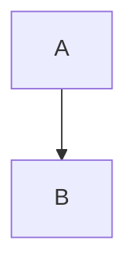

# Design Document Workflow

Create, update, and sync design documents between local markdown and Confluence, using Jira epic/ticket context as input.

## User Input

```text
$ARGUMENTS
```

You **MUST** consider the user input before proceeding (if not empty).

## Configuration

This command uses user-scoped defaults stored at `~/.claude/shiv-design-docs-config.json`. If the config file exists, load it and use the values as prefilled defaults. Users can override any value per invocation.

**Config file format:**
```json
{
  "cloudId": null,
  "defaultSpace": null,
  "defaultParentPageId": null,
  "defaultLabels": ["design-doc"],
  "localDocsDir": "docs/design",
  "docTypes": {
    "tech-arch": { "label": "technical-architecture", "titlePrefix": "Technical Architecture" },
    "detailed-design": { "label": "detailed-design", "titlePrefix": "Detailed Design" },
    "adr": { "label": "adr", "titlePrefix": "ADR" },
    "runbook": { "label": "runbook", "titlePrefix": "Runbook" },
    "api-design": { "label": "api-design", "titlePrefix": "API Design" }
  }
}
```

**On first run** (config file missing or `cloudId` is null):
1. If `~/.claude/shiv-agile-config.json` exists and has a `cloudId`, reuse it — same Atlassian account, no need to re-resolve.
2. Otherwise, call `mcp__atlassian__getAccessibleAtlassianResources` to discover the Atlassian site(s) the connected account can access. If exactly one, use it; if multiple, ask the user to pick.
3. Ask for their default Confluence space key (see Step 2 below for discovery) and save both to the config file.

**Never hardcode a cloudId or space key** — resolve them from the connected user's own Atlassian account.

---

## Step 1: Parse Arguments & Resolve Defaults

1. **Load config** from `~/.claude/shiv-design-docs-config.json` (create if missing)
2. **Parse flags** from `$ARGUMENTS`:
   - `--type TYPE` — document type (tech-arch, detailed-design, adr, runbook, api-design)
   - `--epic KEY` — Jira epic key for context
   - `--tickets KEY1,KEY2` — comma-separated Jira ticket keys (alternative to epic)
   - `--space KEY` — Confluence space key (overrides config default)
   - `--parent PAGE_ID` — parent page ID or title in Confluence
   - `--template PAGE_ID` — Confluence page ID to use as structural template
   - `--ref PAGE_ID` — Confluence page ID to use as reference for structure
   - `--draft` — publish as draft (not visible until published)
   - `--dry-run` — generate local markdown only, do not push to Confluence
   - Everything else is the document description/context
3. **If no description and no epic/tickets provided**: Ask the user what design document they need

---

## Step 2: Resolve Required Parameters

### Document Type

If `--type` is provided, use it. Otherwise ask the user:

```
What type of design document?
  1. tech-arch — Technical Architecture (system design, component diagrams, infrastructure)
  2. detailed-design — Detailed Design (class design, sequence diagrams, data flows)
  3. adr — Architecture Decision Record (decision context, options, rationale)
  4. runbook — Runbook (operational procedures, incident response)
  5. api-design — API Design (endpoints, contracts, schemas)
Type [tech-arch]: _
```

### Confluence Space

If `--space` is provided, use it. Otherwise use `defaultSpace` from config.

If neither exists, fetch available spaces using `mcp__atlassian__getConfluenceSpaces` with `cloudId` from config:

```
Which Confluence space? (enter key or number)
  1. SPE — SaaS Platform East
  2. ENG — Engineering
  ...
Your default space [none]: _
```

Save their choice to config as `defaultSpace`.

### Parent Page

If `--parent` is provided, use it. Otherwise use `defaultParentPageId` from config.

If neither exists, ask the user:

```
Where should this page be placed in Confluence?
  Enter a parent page ID, page title to search for, or press Enter to place at space root: _
```

If the user provides a title (not a numeric ID), search for it using `mcp__atlassian__searchConfluenceUsingCql`:
```
cql: "title = \"<user input>\" AND space.key = \"<space>\" AND type = page"
```

Present matches and let the user pick.

### Epic / Tickets

If neither `--epic` nor `--tickets` is provided, ask:

```
Provide context from Jira:
  Epic key (e.g., SPE-1019): _
  Or comma-separated ticket keys: _
```

At least one of epic or tickets is required.

---

## Step 3: Gather Jira Context

### If epic provided:

1. Fetch the epic using `mcp__atlassian__getJiraIssue` with the epic key
2. Extract: summary, description, acceptance criteria, status, labels
3. Fetch child issues using `mcp__atlassian__searchJiraIssuesUsingJql`:
   ```
   jql: "parent = <epic-key> ORDER BY rank ASC"
   ```
4. For each child issue, extract: key, summary, description, status, issue type

### If tickets provided:

1. Fetch each ticket using `mcp__atlassian__getJiraIssue`
2. Extract: summary, description, acceptance criteria, linked issues, status, labels
3. If tickets share a common parent epic, fetch that epic too for broader context

### Build Context Summary

Compile a structured context object:

```markdown
## Jira Context

**Epic**: SPE-1019 — Implement OAuth2 Authentication
**Status**: In Progress
**Description**: [epic description]

### Stories/Tasks:
1. SPE-1020 — Set up OAuth provider configuration [To Do]
2. SPE-1021 — Implement OAuth callback handler [To Do]
3. SPE-1022 — Add session management [To Do]
4. SPE-1023 — Write auth integration tests [To Do]

### Key Requirements from Acceptance Criteria:
- [extracted requirements]
```

---

## Step 4: Resolve Template

Template resolution follows this priority:

### Priority 1: User-provided template (`--template`)

1. Fetch the template page using `mcp__atlassian__getConfluencePage` with `contentFormat: "markdown"`
2. Extract the structural skeleton:
   - All headings (h1-h6) and their hierarchy
   - Section patterns (what type of content goes under each heading)
   - Any Confluence-specific elements used (panels, status lozenges, expand sections)
   - Table structures
3. Strip the content, keep only the structure
4. Notify user: `Using template from Confluence page: "<page title>"`

### Priority 2: User-provided reference doc (`--ref`)

1. Fetch the reference page using `mcp__atlassian__getConfluencePage` with `contentFormat: "markdown"`
2. Analyze the structural pattern:
   - Heading hierarchy and naming conventions
   - Section ordering
   - Formatting patterns (how diagrams are placed, how decisions are documented)
   - Naming convention for the page title
3. Use the extracted pattern as the template
4. Notify user: `Extracting structure from reference doc: "<page title>"`

### Priority 3: Default built-in template

Before using the default, **always notify the user and give them a chance to provide a template**:

```
No template or reference doc provided.
The default [Technical Architecture] template will be used:

  1. Status
  2. Context & Background
  3. Architecture Overview
     - System Context Diagram
     - Component Diagram
  4. Design Decisions
  5. Data Model
  6. API Contracts
  7. Security Considerations
  8. Performance Considerations
  9. Deployment Strategy
  10. Risks & Mitigations
  11. Open Questions

Proceed with this template? Or provide a Confluence page ID to use as template/reference: _
```

If the user provides a page ID at this point, go back to Priority 1 or 2 flow.
If the user confirms, proceed with the built-in template.

**IMPORTANT**: Refer to the `doc-type-templates` reference file in the `confluence-authoring` skill for the full default templates for each document type.

### Naming Convention

Derive the page title:
1. **From template/ref doc**: If the template or reference doc has a consistent naming pattern (e.g., `[EPIC-KEY] - Technical Architecture - <Feature Name>`), follow that pattern
2. **From config**: Use the `titlePrefix` from the doc type config + epic/feature name
3. **If neither works**, suggest 2-3 options to the user:

```
Suggested page titles:
  1. Technical Architecture - OAuth2 Authentication
  2. [SPE-1019] Technical Architecture - OAuth2 Authentication
  3. SPE-1019: OAuth2 Authentication - Technical Architecture

Which title? (enter number or provide custom): _
```

---

## Step 5: Clarification Round

Before generating content, present assumptions and ask for clarifications. This step ensures the design doc captures what the team actually needs.

### 5a: Present What We Know

```
## Document Plan

**Type**: Technical Architecture
**Epic**: SPE-1019 — Implement OAuth2 Authentication
**Template**: Default Technical Architecture template
**Title**: [SPE-1019] Technical Architecture - OAuth2 Authentication
**Space**: SPE | **Parent**: Architecture Documents
**Status**: Draft

### Context Gathered from Jira:
- 4 stories covering OAuth provider setup, callback handler, session management, testing
- Key requirements: [list extracted requirements]

### Assumptions:
1. [Assumption based on Jira context — e.g., "OAuth2 with PKCE flow based on story descriptions"]
2. [Assumption — e.g., "Session tokens stored server-side based on acceptance criteria"]
3. ...
```

### 5b: Ask Clarifications

Ask a maximum of **5 clarification questions** focused on:
- Architectural scope gaps (what's not covered in Jira tickets)
- Technology choices not specified in tickets
- Non-functional requirements (performance, scale, SLAs)
- Integration boundaries
- Security/compliance specifics

Format:

```
## Clarifications Needed (answer to proceed)

**Q1**: [Specific question about scope or architecture]
  Default assumption: [what we'll use if no answer]

**Q2**: [Question about technology choice]
  Default assumption: [what we'll use if no answer]

**Q3**: [Question about NFRs]
  Default assumption: [what we'll use if no answer]

Answer with "Q1: <answer>, Q2: <answer>, ..." or press Enter to accept all defaults: _
```

If the user presses Enter or says "defaults are fine", proceed with the stated assumptions.

---

## Step 6: Generate Local Markdown

Write the full design document to the local filesystem.

### File Location

```
<localDocsDir>/<epic-key>/<type>.md
```

Example: `docs/design/SPE-1019/tech-arch.md`

If no epic (only tickets), use the first ticket key: `docs/design/SPE-1020/tech-arch.md`

### Frontmatter

Every local design doc includes YAML frontmatter for sync tracking:

```yaml
---
title: "[SPE-1019] Technical Architecture - OAuth2 Authentication"
type: tech-arch
confluencePageId: null
confluenceSpaceKey: SPE
confluenceSpaceId: null
parentPageId: "12345"
jiraEpic: SPE-1019
jiraTickets: [SPE-1020, SPE-1021, SPE-1022, SPE-1023]
status: draft
labels: [technical-architecture, design-doc, SPE-1019]
lastSyncedAt: null
lastLocalEditAt: 2026-05-05T10:00:00Z
lastRemoteEditAt: null
---
```

### Content Generation

Generate the document content by:

1. Following the resolved template structure (user-provided or default)
2. Filling sections with content derived from Jira context + user clarifications
3. Using standard markdown for the local copy
4. Including Mermaid code blocks for diagrams:
   ````markdown
   ```mermaid
   graph TD
     A[Client] --> B[OAuth Provider]
     B --> C[Auth Service]
   ```
   ````
5. Including code blocks with language specifiers:
   ````markdown
   ```typescript
   interface AuthConfig {
     provider: string;
     clientId: string;
   }
   ```
   ````
6. Using tables where data benefits from structured presentation
7. Adding a status indicator at the top of the document:
   ```markdown
   > **Status**: DRAFT | **Last Updated**: 2026-05-05 | **Author**: [user]
   ```

### Quality Checks

After generating, validate:
- [ ] All template sections are populated (no empty sections)
- [ ] Diagrams are syntactically valid Mermaid
- [ ] Jira ticket references are present where relevant
- [ ] Assumptions are documented
- [ ] Open questions are captured

---

## Step 7: User Review

Present the complete document to the user for review before publishing.

```
## Design Document Ready for Review

**File**: docs/design/SPE-1019/tech-arch.md

[Show full document content]

---

### Actions:
  1. **Publish** — Push to Confluence as-is
  2. **Edit** — Tell me what to change
  3. **Abort** — Save locally only, don't publish

Your choice [1]: _
```

If the user chooses **Edit**:
- Accept their feedback
- Update the local markdown file
- Show the updated version
- Ask again until they approve

If the user chooses **Abort**:
- Keep the local file
- Report the file path
- Skip Steps 8-10

---

## Step 8: Convert and Publish to Confluence

### 8a: Convert Markdown to Confluence HTML

Transform the local markdown (excluding frontmatter) to Confluence-flavored HTML following the rules in the `confluence-authoring` skill references:

**Standard Elements:**
- `# Heading` -> `<h1>Heading</h1>` (h1-h6)
- `**bold**` -> `<strong>bold</strong>`
- `*italic*` -> `<em>italic</em>`
- `[text](url)` -> `<a href="url">text</a>`
- Bullet lists -> `<ul><li>...</li></ul>`
- Numbered lists -> `<ol><li>...</li></ol>`

**Code Blocks:**
````markdown
```typescript
code here
```
````
Converts to:
```html
<pre><code class="language-typescript">code here</code></pre>
```

**Mermaid Diagrams:**
````markdown

````
Converts to a Confluence Mermaid macro. Use the structured macro HTML format:
```html
<ac:structured-macro ac:name="mermaid">
  <ac:plain-text-body><![CDATA[graph TD
  A --> B]]></ac:plain-text-body>
</ac:structured-macro>
```

**IMPORTANT**: If the Confluence instance does not support the Mermaid macro (publish fails with macro error), fall back to describing the diagram textually or note it as a limitation. Do NOT silently drop diagrams.

**Tables:**
```markdown
| Col1 | Col2 |
|------|------|
| A    | B    |
```
Converts to:
```html
<table>
  <thead><tr><th>Col1</th><th>Col2</th></tr></thead>
  <tbody><tr><td>A</td><td>B</td></tr></tbody>
</table>
```

**Status Lozenge (at document top):**
```html
<p><strong>Status</strong>: <span data-type="status" data-color="yellow">DRAFT</span> | <strong>Last Updated</strong>: 2026-05-05</p>
```

Status color mapping:
- `draft` -> `yellow`
- `in-review` -> `blue`
- `approved` -> `green`
- `deprecated` -> `red`

**Confluence-Specific Macros — USE SPARINGLY:**

Only add these when the content genuinely warrants it:

- **Info panel**: When there's an important note readers must not miss
  ```html
  <div data-type="panel-info"><p>Important context here</p></div>
  ```

- **Warning panel**: When there's a risk or caveat
  ```html
  <div data-type="panel-warning"><p>Risk or caveat here</p></div>
  ```

- **Expand/collapse**: When there's lengthy detail that most readers can skip
  ```html
  <details><summary>Detailed breakdown</summary><p>content</p></details>
  ```

Do NOT add panels, lozenges, or macros decoratively. They should serve a clear communication purpose.

### 8b: Check for Existing Page

Read the frontmatter from the local markdown file:

- **If `confluencePageId` is null** (first publish):
  1. Search for an existing page with the same title in the target space using `mcp__atlassian__searchConfluenceUsingCql`:
     ```
     cql: "title = \"<page title>\" AND space.key = \"<space>\" AND type = page"
     ```
  2. If found: ask the user whether to update the existing page or create a new one
  3. If not found: create new page

- **If `confluencePageId` is set** (subsequent publish):
  1. Fetch the current page to get the latest version using `mcp__atlassian__getConfluencePage`
  2. Update the existing page

### 8c: Create or Update

**Create new page:**
```
mcp__atlassian__createConfluencePage(
  cloudId: "<cloudId>",
  spaceId: "<spaceId>",
  title: "<page title>",
  body: "<converted HTML>",
  contentFormat: "html",
  parentId: "<parentPageId>",
  status: "draft" | "current"
)
```

**Update existing page:**
```
mcp__atlassian__updateConfluencePage(
  cloudId: "<cloudId>",
  pageId: "<confluencePageId>",
  body: "<converted HTML>",
  contentFormat: "html",
  title: "<page title>",
  versionMessage: "Updated via shiv-design-docs",
  status: "draft" | "current"
)
```

### 8d: Update Local Frontmatter

After successful publish, update the local markdown frontmatter:
- Set `confluencePageId` to the returned page ID
- Set `confluenceSpaceId` to the space ID
- Set `lastSyncedAt` to current timestamp
- Set `lastRemoteEditAt` to current timestamp

---

## Step 9: Link Back to Jira

After successful Confluence publish, link the design document to the Jira epic/tickets.

### Add Remote Link to Epic

Use `mcp__atlassian__editJiraIssue` to add a comment or web link referencing the Confluence page:

1. Add a comment to the epic/tickets:
   ```
   mcp__atlassian__addCommentToJiraIssue(
     cloudId: "<cloudId>",
     issueIdOrKey: "<epic-key>",
     body: "Design document published: [<page title>](<confluence-url>)",
     contentFormat: "markdown"
   )
   ```

2. If the epic/tickets have a "Confluence Page" or "Design Doc" custom field, populate it with the URL.

### Create Issue Link (if applicable)

If the Confluence page is linked to multiple Jira tickets, add a comment to each ticket referencing the design doc.

---

## Step 10: Report Result

After successful publish:

```
## Published: [SPE-1019] Technical Architecture - OAuth2 Authentication

**Confluence URL**: https://<cloudId>/wiki/spaces/<space>/pages/<page-id>
**Status**: Draft
**Space**: SPE — SaaS Platform East
**Parent**: Architecture Documents

### Local Copy
**File**: docs/design/SPE-1019/tech-arch.md
**Synced at**: 2026-05-05T10:30:00Z

### Jira Links
- Added design doc link to SPE-1019 (epic)

### Labels Applied
technical-architecture, design-doc, SPE-1019

### Next Steps
- Edit locally and run `/design-doc` again to update Confluence
- `/pull-doc <page-id>` — Pull latest from Confluence to local
- `/list-docs` — View all local design docs and sync status
- Change status on Confluence: DRAFT -> IN REVIEW -> APPROVED
```

If `--dry-run` was specified, show the summary with local file path only and skip Confluence publishing.

---

## Conflict Resolution (Bidirectional Sync)

When publishing or pulling, always check for conflicts:

### Detecting Conflicts

A conflict exists when:
- `lastSyncedAt` < `lastLocalEditAt` AND `lastSyncedAt` < `lastRemoteEditAt` (both sides changed since last sync)

### Resolving Conflicts

When a conflict is detected, present the user with options:

```
## Sync Conflict Detected

The document has been modified both locally and on Confluence since the last sync.

**Last synced**: 2026-05-03T10:00:00Z
**Local edit**: 2026-05-04T14:00:00Z
**Remote edit**: 2026-05-04T16:30:00Z

Options:
  1. **Keep local** — Overwrite Confluence with your local version
  2. **Keep remote** — Overwrite local with the Confluence version
  3. **Show diff** — Show the differences between local and remote
  4. **Abort** — Do nothing, resolve manually

Your choice: _
```

If the user chooses **Show diff**:
- Fetch the remote version as markdown
- Show a section-by-section comparison highlighting differences
- Then ask again: keep local, keep remote, or abort

**NEVER auto-resolve conflicts. Always let the user decide.**

---

## Error Handling

- **Confluence API errors**: Show the error message, suggest checking space/page permissions
- **Jira API errors**: Show the error, continue without Jira context if user agrees
- **Template page not found**: Show error, offer to proceed with default template
- **Mermaid macro not supported**: Warn the user, keep the Mermaid code as a code block with a note
- **Page title conflict**: Ask user to rename or update the existing page
- **Missing required fields**: Prompt user for the missing information, never fail silently

---

## Anti-Patterns to Avoid

- **Over-decorating with Confluence macros**: Only use panels, lozenges, expand when content demands it
- **Empty template sections**: If a section has no content, add a placeholder note like "To be determined" rather than leaving it blank — but prefer asking the user during clarification round
- **Dropping diagrams silently**: If Mermaid conversion fails, always inform the user
- **Publishing without review**: Always show the user the complete document before pushing to Confluence
- **Ignoring sync metadata**: Always update frontmatter timestamps after every sync operation
- **Hardcoding Confluence IDs**: Always resolve space IDs and page IDs dynamically
