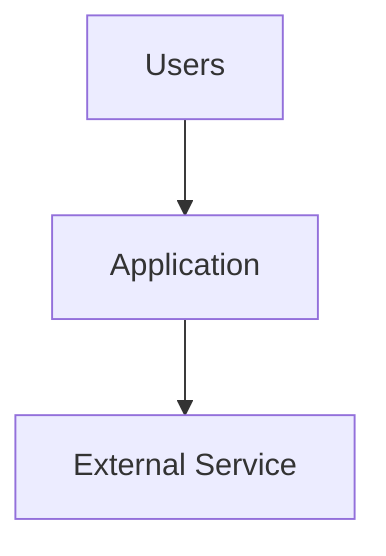
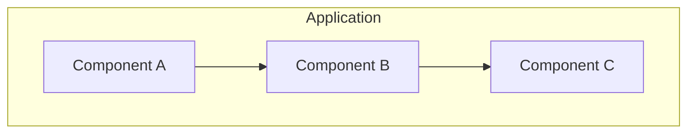
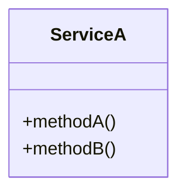
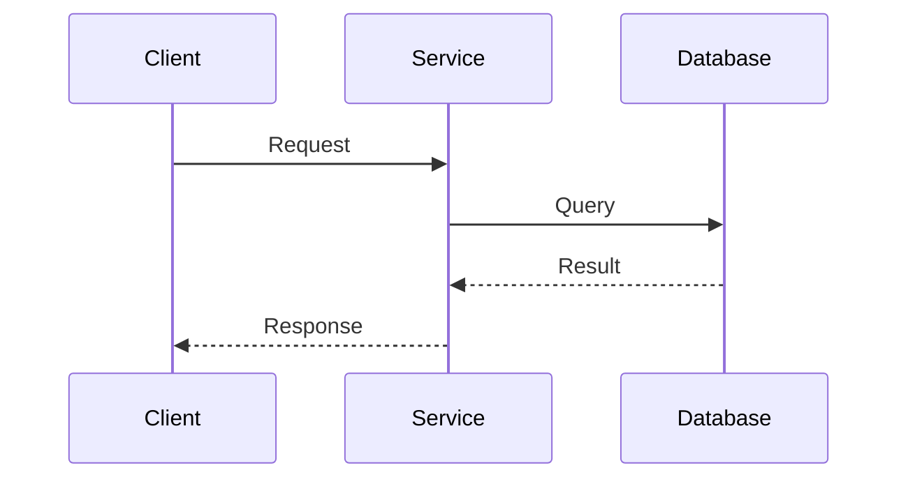
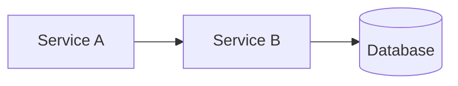

# Design Document Type Templates

Default templates for each design document type. These are used **only** when the user has not provided a `--template` or `--ref` page. Always notify the user before applying a default template and give them a chance to provide their own.

---

## Technical Architecture (`tech-arch`)

```markdown
## Status
> **Status**: DRAFT | **Last Updated**: [DATE] | **Epic**: [EPIC-KEY]

## Context & Background
[Business context from Jira epic. Why this architecture is needed. What problem it solves.]

## Scope
### In Scope
- [What this document covers]

### Out of Scope
- [What this document explicitly does not cover]

## Architecture Overview

### System Context Diagram
[High-level diagram showing the system and its external dependencies]



### Component Diagram
[Internal components and their interactions]



## Design Decisions

### Decision 1: [Title]
**Context**: [Why this decision is needed]
**Options Considered**:
| Option | Pros | Cons |
|--------|------|------|
| Option A | ... | ... |
| Option B | ... | ... |

**Decision**: [Chosen option]
**Rationale**: [Why this option was chosen]

## Data Model
[Entity relationships, key schemas, storage decisions]

## API Contracts
[Key API endpoints, request/response schemas, integration points]

## Security Considerations
[Authentication, authorization, data protection, compliance]

## Performance Considerations
[Expected load, latency targets, scalability approach, caching strategy]

## Deployment Strategy
[How this will be deployed, rollback plan, feature flags]

## Risks & Mitigations
| Risk | Impact | Likelihood | Mitigation |
|------|--------|------------|------------|
| ... | High/Medium/Low | High/Medium/Low | ... |

## Open Questions
- [ ] [Unresolved question 1]
- [ ] [Unresolved question 2]
```

---

## Detailed Design (`detailed-design`)

```markdown
## Status
> **Status**: DRAFT | **Last Updated**: [DATE] | **Epic**: [EPIC-KEY]

## Overview
[What this detailed design covers and how it relates to the technical architecture]

## Requirements Summary
[Key requirements from Jira stories driving this design]

| Story | Summary | Key Requirement |
|-------|---------|-----------------|
| [KEY] | ... | ... |

## Detailed Component Design

### [Component Name]

#### Responsibilities
- [What this component does]

#### Class/Module Structure


#### Sequence Diagrams
[Key interaction flows]



## Data Flow
[How data moves through the system for key operations]

## Error Handling
[Error scenarios, retry strategies, fallback behavior]

| Error Scenario | Handling Strategy | User Impact |
|----------------|-------------------|-------------|
| ... | ... | ... |

## Database Changes
[Schema changes, migrations, index additions]

## Configuration
[New config parameters, environment variables, feature flags]

## Testing Strategy
[Unit test approach, integration test plan, test data needs]

## Migration Plan
[How existing data/users transition to the new design]

## Open Questions
- [ ] [Unresolved question 1]
```

---

## Architecture Decision Record (`adr`)

```markdown
## Status
> **Status**: DRAFT | **Last Updated**: [DATE] | **Epic**: [EPIC-KEY]

## Decision
[One-sentence summary of the decision]

## Context
[What is the issue that is motivating this decision? What forces are at play?]

## Options Considered

### Option 1: [Name]
**Description**: [How this option works]
**Pros**:
- [Advantage 1]
- [Advantage 2]

**Cons**:
- [Disadvantage 1]
- [Disadvantage 2]

**Estimated Effort**: [T-shirt size or story points]

### Option 2: [Name]
**Description**: [How this option works]
**Pros**:
- [Advantage 1]

**Cons**:
- [Disadvantage 1]

**Estimated Effort**: [T-shirt size or story points]

## Decision Outcome
**Chosen Option**: [Option name]
**Rationale**: [Why this option was selected over others]

## Consequences

### Positive
- [Good outcome 1]

### Negative
- [Tradeoff or risk accepted]

### Neutral
- [Side effect that is neither good nor bad]

## Compliance & Security Impact
[Any compliance, security, or regulatory implications of this decision]

## Related Decisions
- [Link to related ADRs or design docs]
```

---

## Runbook (`runbook`)

```markdown
## Status
> **Status**: DRAFT | **Last Updated**: [DATE] | **Epic**: [EPIC-KEY]

## Overview
[What system/service this runbook covers and when to use it]

## Prerequisites
- [ ] [Access/permissions needed]
- [ ] [Tools required]
- [ ] [Knowledge prerequisites]

## Architecture Context
[Brief system diagram showing relevant components]



## Standard Operating Procedures

### Procedure 1: [Name]
**When to use**: [Trigger condition]
**Estimated time**: [Duration]

1. [Step 1 — be specific, include exact commands]
   ```bash
   kubectl get pods -n production
   ```
2. [Step 2]
3. [Step 3]

**Expected outcome**: [What success looks like]
**If it fails**: [Escalation path]

### Procedure 2: [Name]
...

## Incident Response

### Severity Classification
| Severity | Definition | Response Time | Escalation |
|----------|-----------|---------------|------------|
| P1 | ... | ... | ... |
| P2 | ... | ... | ... |

### Common Failure Scenarios

#### Scenario: [Name]
**Symptoms**: [How to identify this failure]
**Root cause**: [Known cause]
**Resolution**:
1. [Step 1]
2. [Step 2]

**Prevention**: [How to prevent recurrence]

## Monitoring & Alerts
| Alert | Threshold | Dashboard | Action |
|-------|-----------|-----------|--------|
| ... | ... | ... | ... |

## Contacts & Escalation
| Role | Contact | When to Engage |
|------|---------|----------------|
| ... | ... | ... |

## Change Log
| Date | Author | Change |
|------|--------|--------|
| ... | ... | ... |
```

---

## API Design (`api-design`)

```markdown
## Status
> **Status**: DRAFT | **Last Updated**: [DATE] | **Epic**: [EPIC-KEY]

## Overview
[What API this document covers, target consumers, versioning strategy]

## Base URL & Versioning
- **Base URL**: `https://api.example.com/v1`
- **Versioning**: URL path (`/v1/`, `/v2/`)
- **Authentication**: Bearer token (JWT)

## Endpoints

### [Resource Name]

#### GET /resource
**Description**: [What this endpoint does]
**Authentication**: Required
**Authorization**: [Required roles/permissions]

**Query Parameters**:
| Parameter | Type | Required | Description |
|-----------|------|----------|-------------|
| `page` | integer | No | Page number (default: 1) |
| `limit` | integer | No | Items per page (default: 20, max: 100) |

**Response (200)**:
```json
{
  "data": [
    {
      "id": "string",
      "name": "string",
      "createdAt": "2026-05-05T10:00:00Z"
    }
  ],
  "pagination": {
    "page": 1,
    "limit": 20,
    "total": 150
  }
}
```

**Error Responses**:
| Status | Description |
|--------|-------------|
| 401 | Unauthorized — invalid or missing token |
| 403 | Forbidden — insufficient permissions |

#### POST /resource
**Description**: [What this endpoint does]
**Authentication**: Required

**Request Body**:
```json
{
  "name": "string (required, 1-255 chars)",
  "description": "string (optional, max 2000 chars)"
}
```

**Response (201)**:
```json
{
  "id": "string",
  "name": "string",
  "createdAt": "2026-05-05T10:00:00Z"
}
```

## Data Models

### [Model Name]
| Field | Type | Required | Description |
|-------|------|----------|-------------|
| `id` | UUID | Yes | Unique identifier |
| `name` | string | Yes | Display name |

## Error Format
All errors follow a consistent format:
```json
{
  "error": {
    "code": "VALIDATION_ERROR",
    "message": "Human-readable description",
    "details": [
      { "field": "name", "message": "Required field" }
    ]
  }
}
```

## Rate Limiting
| Tier | Limit | Window |
|------|-------|--------|
| Standard | 100 req | 1 minute |
| Premium | 1000 req | 1 minute |

## Pagination
[Pagination strategy: offset-based, cursor-based, or keyset]

## Webhooks (if applicable)
[Webhook events, payload format, retry policy]

## Migration Notes
[Breaking changes, deprecation timeline, migration guide]

## Open Questions
- [ ] [Unresolved question 1]
```

---

## Template Usage Rules

1. **Always notify the user** before applying a default template
2. **Show the section outline** so the user can approve or provide their own template
3. **Sections are guidelines, not requirements** — remove sections that don't apply to the specific design
4. **Adapt section depth** to the complexity of the feature — a simple ADR doesn't need 20 sections
5. **Placeholder content** (text in square brackets) must all be replaced before publishing
